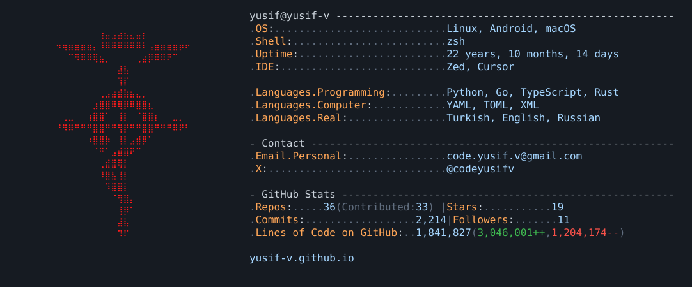

<a href="https://yusif-v.github.io/Index/index.html">
  <picture>
    <source media="(prefers-color-scheme: dark)" srcset="./dark_mode.svg">
    <source media="(prefers-color-scheme: light)" srcset="./light_mode.svg">
    
  </picture>
</a>

 
 

### `→` [**yusif-v.github.io**](https://yusif-v.github.io/Index/index.html)

